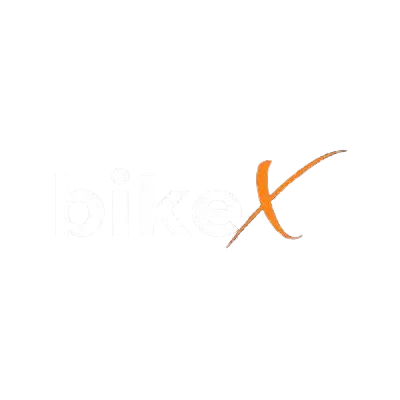
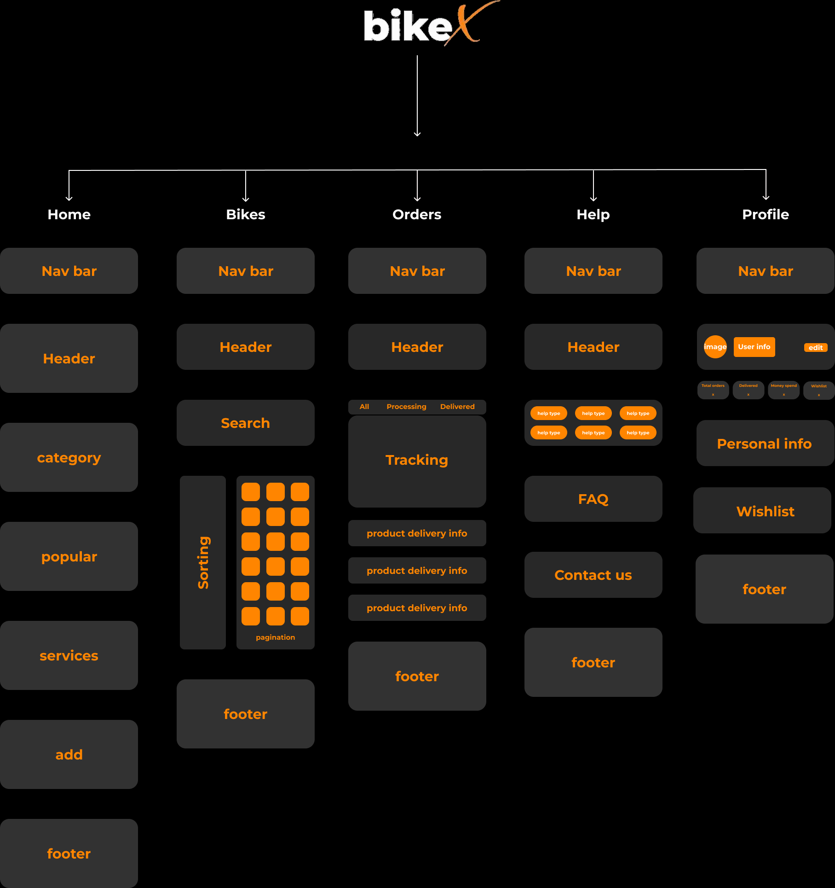

  

 

 <h1 align="center" style="color: #FF8500 " >FlowChart</h1>

  

 <h2>About the Project</h2>

BikeX is a full-stack bicycle sales platform designed to manage bicycles, brands, customers, and the overall bike-selling process.

The application consists of a React frontend and an Express + TypeScript backend, with JWT authentication for secure user access.
 
 
 

<h1>Tech Stack</h1>

<h2>Frontend</h2>
React 
TypeScript 
Vite 
CSS 
<h2>Backend</h2>
Node.js 
Express 
TypeScript 
EJS 
<h2>Authentication</h2>
JWT (JSON Web Token) 
<h2>Database</h2>
MongoDB 
Mongoose 
